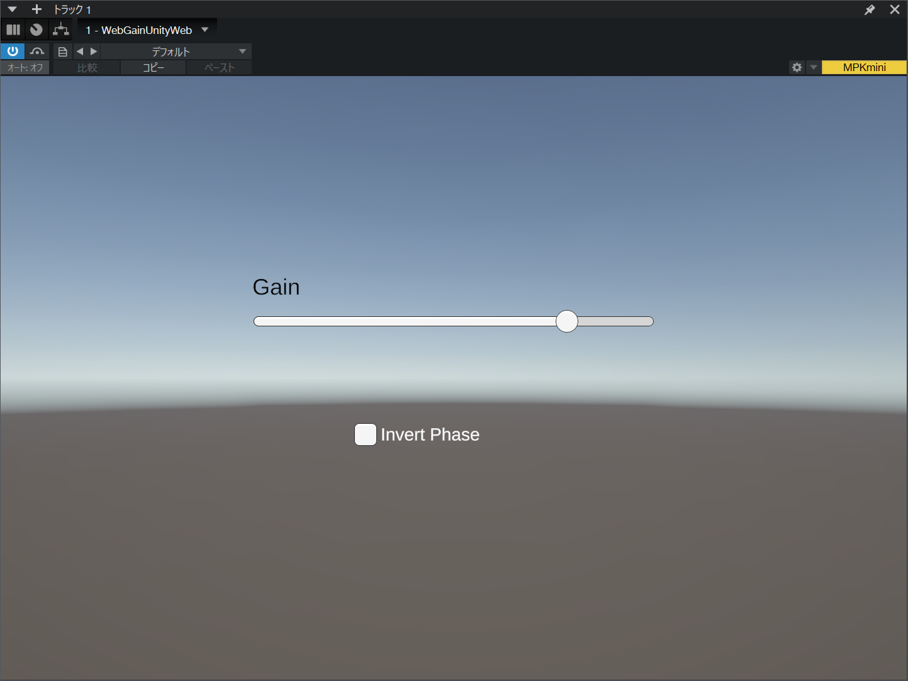
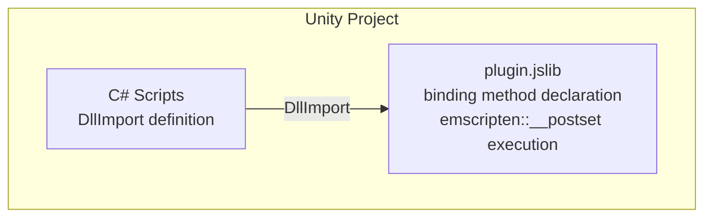
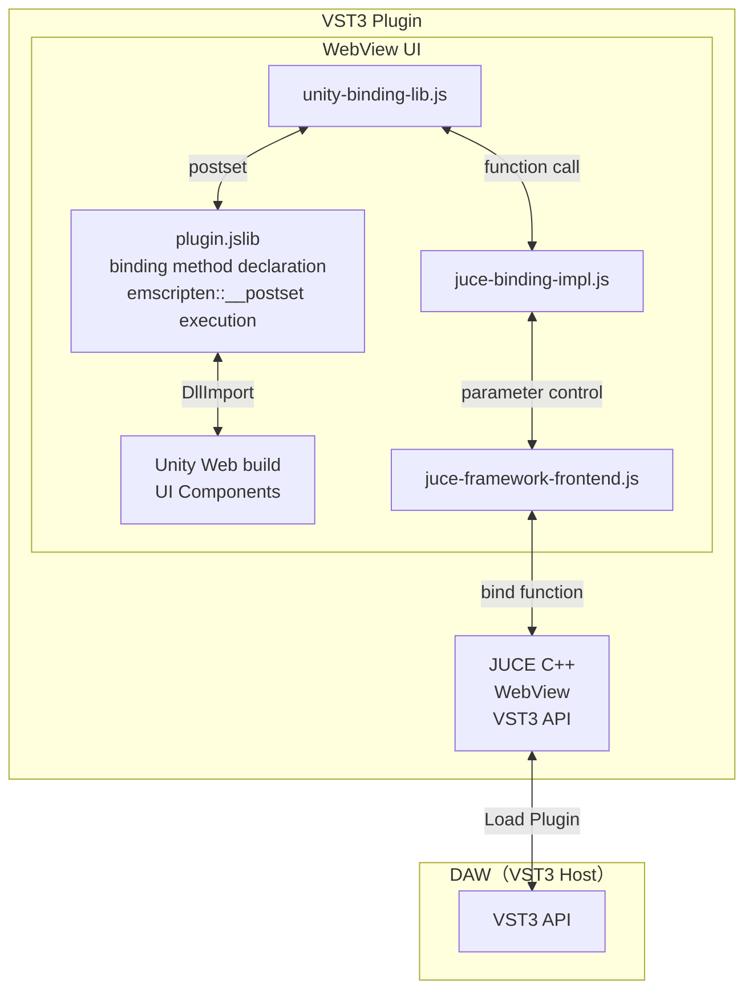

# audio-plugin-unity-web-ui
This is an example of implementing a graphical user interface for audio plugin with Unity Web platform.

## Supported versions

- Unity 6000.0.29f1
- JUCE 8.0.4
- Visual Studio 2022
- Xcode 15.1
- Deno 2.1.3 (for build utility tools)

## System overview

